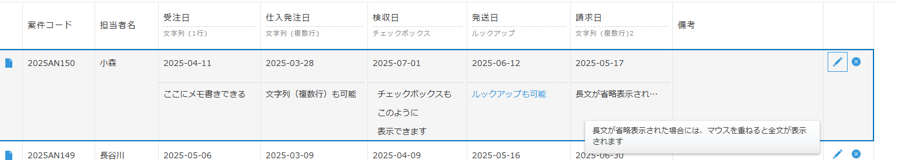

# kintone 2段表示プラグイン

## 概要

このプラグインは、kintoneのレコード一覧画面で、フィールドを2段で表示できるようにするものです。Excelの進捗管理表などで、1つのセルの中に想定された内容以外のメモ書きを混ぜるような使い方をしているケースにおいて、スムーズにkintone上に運用を大幅に変えずに移行するときに役立ちます。

## 制作意図

kintoneでは通常、1つのフィールドには1つの情報しか格納できません。しかし、Excelなどから移行する際に、「1つのセルに複数の情報を入れていた」というケースがよくあります。

例えば：
- 「案件名」フィールドに、案件名とその補足情報を一緒に入れていた
- 「納期」フィールドに、日付と納期に関するメモを一緒に入れていた

このプラグインを使用すると、kintoneのデータ構造を大きく変えずに、Excel的な使い方を維持しながら、データ管理を効率化することができます。

## 主な機能

1. **レコード一覧画面でフィールドを2段で表示**
   - 上段：通常のフィールド（選択されたフィールド）
   - 下段：上段フィールドに紐づくメモ欄としてのフィールド

2. **一覧ごとの設定保存**
   - 異なる一覧ビューごとに異なる2段表示の設定を保存可能
   - 複数の一覧ビューで異なる表示形式を実現

3. **直接編集対応**
   - kintoneの標準機能である一覧からの直接編集に対応
   - 編集モード時も適切に上下段のフィールドを表示

## 使い方

### インストール方法

#### GitHubリリースからダウンロード

1. [GitHubリリースページ](https://github.com/Mistizz/2tierDisplay/releases/tag/v1.0.0)から最新版の`2tierDisplay.zip`をダウンロードします
2. kintoneシステム管理画面から「プラグイン」を選択します
3. 「読み込む」から、ダウンロードしたZIPファイルをアップロードします
4. アップロードしたプラグインを「アプリの設定」＞「設定」タブ＞「プラグイン」から有効化します

### プラグインの設定方法

1. プラグインを適用したいアプリの設定画面を開きます
2. 「プラグイン」タブから「2段表示プラグイン」の設定アイコンをクリックします
3. 以下の設定を行います：
   - **対象の一覧ビュー**: アプリで作成されているすべての一覧から、2段表示を適用する一覧ビューを選択します
   - **フィールドマッピング**: 上段と下段のフィールドの組み合わせを設定します
     - 「上段フィールド」: 通常表示するフィールドを選択
     - 「下段フィールド」: 上段フィールドの下に表示するメモ欄などのフィールドを選択
   - 「マッピングを追加」ボタンで複数の組み合わせを設定できます
4. 設定が完了したら「この一覧の設定を保存」ボタンをクリックします
   - 別の一覧に切り替える前に必ず保存してください
   - 保存せずに一覧を切り替えると、最新の設定内容が失われます
5. すべての一覧の設定が完了したら「すべて保存」ボタンをクリックします

### 設定可能なフィールドタイプ

以下のフィールドタイプが上段および下段フィールドとして設定可能です：
- テキスト（1行）
- テキスト（複数行）
- リンク
- 数値
- 計算
- ラジオボタン
- チェックボックス
- ドロップダウン
- 複数選択
- 日付
- 日時
- 時刻
- ユーザー選択
- グループ選択
- 組織選択
- レコード番号
- 作成日時
- 作成者
- 更新日時
- 更新者

### 設定できないフィールドタイプ

以下のフィールドタイプは上段および下段フィールドとして設定できません：
- ステータス
- カテゴリー
- 作業者
- ラベル
- スペース
- 関連レコード一覧
- グループ
- テーブル

### 注意事項

1. **フィールドの表示設定**
   - 2段表示を設定するフィールドは、対象の一覧ビューに表示されている必要があります
   - 一覧ビューに表示されていないフィールドはドロップダウンリストに表示されず、選択できません

2. **一覧ビューの設定**
   - 同じ名前の一覧ビューが複数存在する場合、プラグインが正常に機能しない場合があります
   - 一覧ビューの名前は一意になるように設定してください

3. **フィールド名の重複**
   - 同じフィールド名で異なるフィールドコードを持つフィールドを下段フィールドとして設定すると、正常に動作しない場合があります
   - これはレコード一覧のDOM中にフィールドコードが含まれておらず、フィールド名とフィールドIDの対応しか読み取れないためです
   - 同じフィールド名のフィールドを下段フィールドとして設定しないようにしてください

4. **列幅の設定**
   - 2段表示を適用した状態で列幅を変更しようとすると、下段フィールドの値が範囲外になるため正常に動作しません
   - 2段表示を適用する前に、一覧ビューの列幅設定を完了させてください

5. **編集機能**
   - 下段フィールドも、レコード一覧画面から直接編集できます

6. **他のプラグインとの互換性**
   - このプラグインの他プラグインとの競合調査は行っていません
   - 一覧画面のDOM操作を行う他のプラグインと競合し、正常に機能しなくなる恐れがあります

## 動作環境

- kintone: 最新版推奨
- ブラウザ: Google Chrome、Microsoft Edge の最新版

## リリース情報

最新バージョン: [v1.0.0](https://github.com/Mistizz/2tierDisplay/releases/tag/v1.0.0) (2025年3月7日リリース)

詳細なリリースノートは[こちら](https://github.com/Mistizz/2tierDisplay/releases)でご確認いただけます。

## ライセンス

このプラグインは [MIT License](LICENSE) の下で公開されています。

## サポート・貢献

バグ報告や機能リクエストは、GitHub Issuesにて受け付けています。
プルリクエストも歓迎します。

---

© 2025 Akihiro Kamahara 